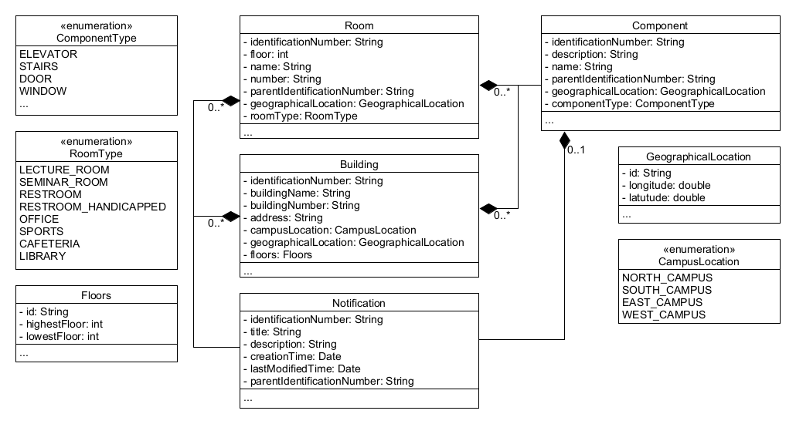

# Bounded Context Entity Relation View

This diagram describes the building entity, with its rooms, components and notifications. The abstract class AccessibleObject, provides us the possibility to handle rooms and buildings same, and collects ther redundant attributes and methods. The notificatable interface provides an interface to manage notifications.

A description of the identification number called "in" in this diagram can be found in the [Ubiquitous Language](https://git.scc.kit.edu/-/ide/project/cm-tm/cm-team/3.projectwork/pse/docsc/tree/english-translation/-/pages/ubiquitous_language.md/).
 
