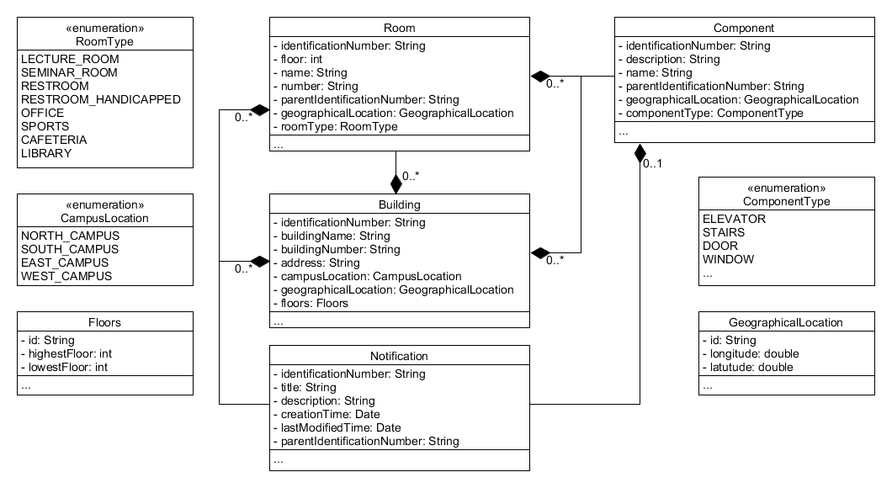

# Bounded Context Entity Relation View

A description of the identification number in this diagram can be found in the [Ubiquitous Language](https://git.scc.kit.edu/-/ide/project/cm-tm/cm-team/3.projectwork/pse/docsc/tree/master/-/pages/ubiquitous_language.md/).
 
